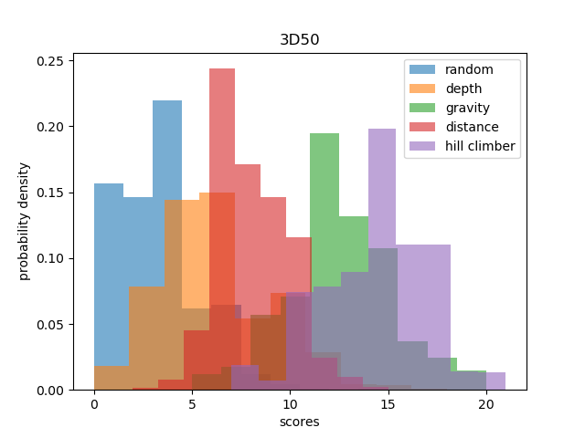
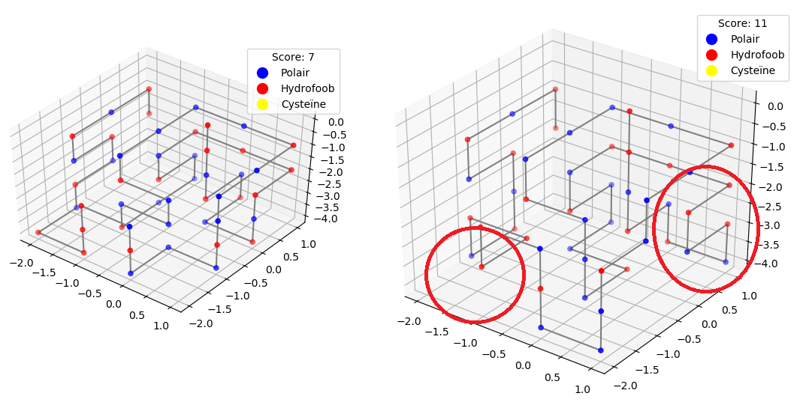

# Programmertheorie (Heuristieken): Protein Pow(d)er

## Inleiding

Teamleden: Nienke, Moussa, Jason

Eiwitten zijn opgebouwd uit aminozuurketens die ieder hun eigen processen reguleren in het menselijk lichaam. De functie van zo'n eiwit is afhankelijk van de aminozuursequentie, en de vouwingen ten gevolge van de genoemde sequentie. Eiwitten die verkeerd gevouwen zijn, worden veelal gecorreleerd met verschillende ziektes en aandoeningen. Het is daarom van belang dat de medische wetenschapen een goed beeld hebben van hoe die vouwingen per eiwit tot stand komen. De vouwingen worden bepaald door een aantal eigenschappen en voor dit project wordt alleen gelet op hydrofobe interacties, waarbij het eiwit stabieler is wanneer twee hydrofobe (H) aminozuren naast elkaar liggen. Aminozuren met een polaire (P) eigenschap dragen niet bij aan de stabiliteitscore. Hoe meer H-bindingen naast elkaar, hoe stabieler het eiwit.

In dit project wordt met behulp van een aantal algoritmes gekeken wat voor elk aminozuursequentie het meest stabiel is.

#### TODO:
Verdere uitwerking van aanpak algoritmes voor oplevering.

De volgende algoritmes werden toegepast:
1. Random
2. Distance (constructief): Greedy op basis van het afstand tussen H-bindingen
3. Gravity (constructief): Greedy op basis van het zwaartepunt
4. Depth First (constructief): Stabiliteitscore berekenen van verschillende mogelijke paden voordat een stuk van het eiwit wordt gebouwd
5. Hill Climber (iteratief): Kleine aanpassingen maken die bijdragen aan de stabiliteit (op basis van Gravity-algoritme). Hierbij worden twee aminozuren gepakt met ééntje ertussen. Wanneer het middelste aminozuur op een vouwing ligt, wordt deze 180 graden om de twee eerdergenoemde aminozuren
geflipt.

Aannames die zijn meegenomen:
- De aminozuursequenties zijn gebouwd op een grid met hoeken van 90 graden.
- Alleen hydrofobe bindingen (H) bepalen de scores.

### Gebruiksinstructies

1. In de terminal initieer je het programma vanaf de juiste directory met: ``python main.py``
2. Vervolgens verschijnt er een prompt die vraagt om (1) aminozuursequentie; (2) keuze algoritme; (3) aantal iteraties; (4) gepresenteerd in 2D of 3D.
3. Nadat de opties zijn ingevoerd, verschijnt er een pop-up met een interactieve figuur van het meest stabiele eiwit dat gevonden kan worden met de gekozen algoritme.
4. De stabiliteitsscores en figuur worden respectievelijk opgeslagen op een ``.csv``- en ``.png``-bestand in de folder ``/results``.
5. Wanneer alle vijf algoritmes zijn toegepast, kan er een histogram gemaakt worden met de resultaten over elkaar heen geplot. Dit wordt uitgevoerd met: ``python plot_all.py``.

#### Note: De resultaten hieronder zijn gebaseerd op de aminozuursequentie HHPHPHPHPHHHHPHPPPHPPPHPPPPHPPPHPPPHPHHHHPHPHPHPHH in 3D-formaat (3D50).

#### TODO:
Vergelijk met 2D50 en bespreek hoe dit de scores beinvloed.

## Resultaten

### Algoritmes vergelijken

**Figuur 1**. Stabiliteitsscore-distributies van de vijf algoritmes op 3D50

In bovenstaand figuur zijn de distributies van de stabiliteitsscores van het 3D50-eiwit weergegeven, waarbij elk algoritme met duizend iteraties werd toegepast. Op de x-as staan de scores en op de y-as de kansdichtheid van elke score. Zoals verwacht vertoonde het Random-algoritme veel scores van minder dan 5 met een optimum van 4 en een maximum van 11. Vergeleken met de andere algoritmes uit dit project produceert random relatief vaker aminozuurketens die veel rechte ketens bevatten met weinig vouwingen. Random houdt weinig rekening met de ruimte om zich heen, behalve dat die geen aminozuren mag zetten op plekken waar er al eentje staat. Dit leidt ertoe dat hydrofobe aminozuren weinig met elkaar interacteren, wat leidt tot lagere stabiliteit. De twee greedy-algoritmes scoorden beter met een optimum en maximum van respectievelijk 6, 14 (Distance) en 12, 20 (Gravity). Beide algoritmes waren in staat om meer dan één H-binding te vinden. Dat deze greedy's beter scoren was te verwachten, omdat meerdere condities oplegt. Distance berekent na elke stap de afstand tot de dichtstbijzijnde hydrofobe aminozuur, en neemt dan het kortste pad, wat leidt tot minder rechte stukken en het vergroot de kans op een H-bindingen. Gravity bouwt op een gegeven moment als een slang, en waar mogelijk, voortdurend richting het zwaartepunt, waardoor het eiwit zeer compact wordt en aminozuren onder de buitenste laag vrijwel altijd omgeven wordt door andere aminozuren, met elk een kans op een H-binding. De mate van compactheid verklaart mogelijk waarom Gravity beter is dan Random en Distance met het bereik van het maximum.   

Zowel Distance als Gravity maken keuzes die op het moment het beste lijken te zijn, zonder vooruit te kijken. Hierdoor bestaat er een grotere kans dat er opties worden overgeslagen, omdat het aanvankelijk de score niet verbetert, maar later juist wel en misschien nog meer dan de gekozen greedy-pad. Met Depth First werd dan ook verwacht dat deze een betere score zou opleveren dan de greedy-algoritmes. Echter, het optimum was 6, lager dan die van beide greedy's, en het had een maximum score van 18, hoger dan Distance, maar lager dan Gravity. Op het moment van schrijven was de lookahead-parameter ingesteld op 6 stappen. Het is mogelijk dat 6 stappen vooruitdenken niet voldoende is om dezelfde reden dat die opties overslaat, terwijl de berekeningen van grotere stappen juist meer kan opleveren. Het verhogen van deze parameter was op het moment van schrijven niet gelukt, omdat het erg veel rekentijd vergde. Het probleem van Depth First was dat ons algoritme geen rekening hield met pruning en het controleren van de constraints, waardoor het heel veel geheugen moest opslaan bij het berekenen.

Als laatste werd Hill Climber toegepast op het 3D50-eiwit. Dit algoritme maakt kleine aanpassingen op een willekeurige begin state door eiwitvouwingen te flippen. Een nadeel is dat dit algoritme niet erg efficient is wanneer de begin state van het eiwit veel rechte stukken bevat, zoals bij Random. Om dat te voorkomen werd Gravity toegepast om begin states te creëren, die veel vouwingen produceert. Omdat Gravity het beginpunt is, wordt er verwacht dat deze versie van Hill Climber qua stabiliteit op z'n minst beter moet scoren dan Gravity. Figuur 1 toonde aan dat Hill Climber verbeterde ten opzichte van Greedy. Vergeleken met de andere algoritmes was Hill Climber het beste algoritme van onze selectie, met 21 als maximum en 15 optimum. Hoewel Greedy veel vouwingen bevat, de condensed eiwitstructuur zorgt er wel voor dat er weinig plek is om aminozuren te flippen binnen het eiwit, waardoor er minder condensed oplossingen worden overgeslagen.

**Figuur 2**. Voorbeeld Hill Climber met Gravity als begin state (score = 7) en het resultaat van hetzelfde eiwit (score = 11). De rode cirkels benadrukken een selectie van de geflipte aanpassingen.  

### Parameter tuning

#### TODO:
Figuur Optimum Depth First 4, 6, 8, 10.
Figuur Optimum Hill Climber: aantal flips - 5, 7, 10, 15.

### Baseline

#### Ontwerp
Als baseline oplossing voor de casus Protein Pow(d)er hebben wij gebruik gemaakt van de random module van python. Het random algoritme maakt een willekeurige keuze voor het volgende punt van de ketting. De opties hiervoor zijn omhoog, omlaag, links, rechts, boven en onder (voor in 3d). Voordat het random aloritme een keuze maakt sluiten wij echter de opties uit waarbij de ketting overlapt. In bepaalde situaties zal de ketting hierdoor vastlopen doordat er geen opties beschikbaar zijn, in dit geval resetten wij het programma. In het onderstaande voorbeeld wordt een vastgelopen situatie weergeven waarbij de ketting een tunnel is ingelopen en daardoor geen mogelijke richtingen kan kiezen zonder in overlap te eindigen.

#### Resultaat
De onderstaande grafiek laat zien dat bij afspelen van 10.000 willekeurige oplossingen de score (hoeveelheid hydrofobe bindingen) normaal verdeeld is. De grafiek begint bij een score van nul waardoor de normaal verdeling alleen aan de rechterkant zichtbaar is. Het resetten van het programma na vastlopen heeft geen gevolgen op de verdeling van de score omdat de ongeldige resultaten worden vervangen door alternatieven met gelijke kansen als wanneeer het resetten niet was gebeurd. Wij hebben een algoritme getest waarbij de algoritme een stapje terugzet in plaats van gereset wordt met als gevolg dat de stapje terug -algoritme en reset-algoritme tot dezelfde verdeling komen. Het resetten van verkeerde oplossingen leidt echter tot een snellere uitwerking bij het afspelen van grote steekproeven.

